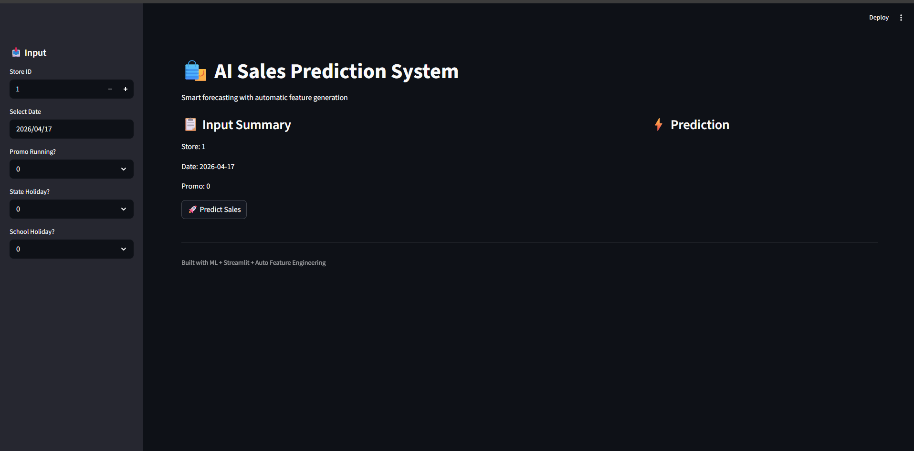
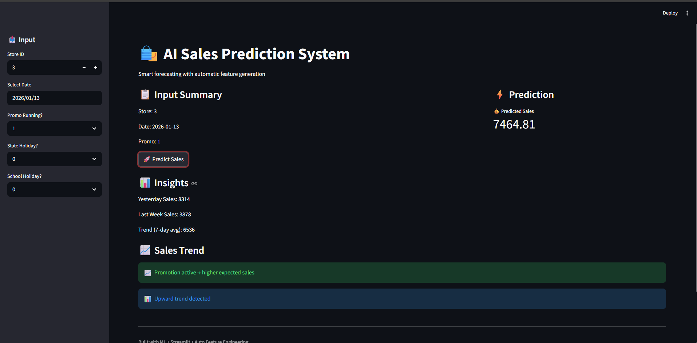
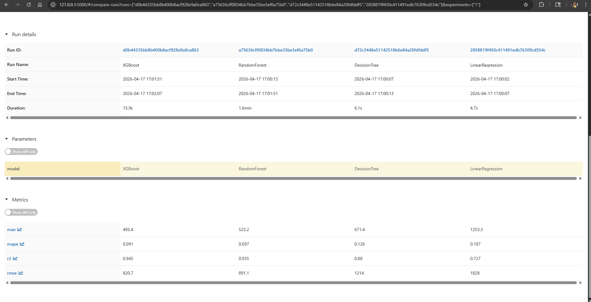
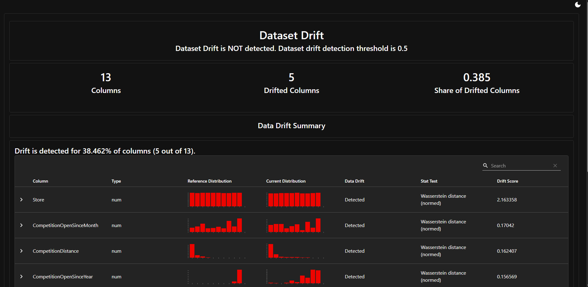

# 🛍️ AI Sales Forecasting System

## 📌 Overview
An end-to-end **AI/ML-powered sales forecasting system** that predicts future retail sales using historical data, time-series feature engineering, and machine learning models.

The system includes:
- 📊 Automated feature engineering
- 🤖 Multi-model training & evaluation
- 📈 Drift detection using Evidently AI
- 🔁 Automated retraining pipeline
- 🌐 Interactive Streamlit dashboard

---

# 🎯 Problem Statement
Retail businesses struggle to:
- Predict future sales accurately
- Handle seasonal demand fluctuations
- Adapt to changing customer behavior
- Maintain model performance over time

👉 This project solves these challenges by building a **self-monitoring ML system** that:
- Predicts sales
- Detects data drift
- Retrains automatically

---

# ⚙️ Tech Stack

## 🔹 Languages & Tools
- Python
- Streamlit
- MLflow
- Evidently AI

## 🔹 Libraries
- pandas
- numpy
- scikit-learn
- xgboost
- matplotlib

---

# 📊 Dataset Used

## 🧾 Rossmann Store Sales Dataset


Contains:
- Store information
- Daily sales
- Promotions
- Holidays
- Competition data

👉 Real-world dataset widely used for retail forecasting

---

# 🧠 Features Used

## 🔹 Time Features
- Day, Month, Year
- Day of Week
- Week of Year

## 🔹 Business Features
- Promo
- StateHoliday
- SchoolHoliday

## 🔹 Time-Series Features (Key)
- lag_1 (yesterday sales)
- lag_7 (last week)
- lag_14
- rolling_mean_7
- rolling_std_7

---

# 🤖 Models Used

- Linear Regression
- Decision Tree
- Random Forest
- XGBoost (Best Performing Model)

---

# 📈 Metrics Used

- MAE (Mean Absolute Error)
- RMSE (Root Mean Squared Error)
- R² Score
- MAPE (Mean Absolute Percentage Error)

---

# 🧪 MLflow Integration

Used MLflow for:
- Experiment tracking
- Model comparison
- Logging metrics
- Model versioning

---

# 🔧 Hyperparameter Tuning

Optimized XGBoost with:
- n_estimators = 300
- max_depth = 8
- learning_rate = 0.05
- subsample = 0.8
- colsample_bytree = 0.8

---

# 🔄 ML Pipeline

1. Data Ingestion
   ↓
2. Data Preprocessing
   ↓
3. Feature Engineering
   ↓
4. Model Training & Evaluation
   ↓
5. Model Tracking (MLflow)
   ↓
6. Prediction (Streamlit App)
   ↓
7. Drift Detection (Evidently AI)
   ↓
8. Retraining Pipeline

---

# 🔍 Drift Detection (Evidently AI)

- Compares historical vs new data
- Detects feature distribution changes
- Generates detailed HTML reports

### Output Includes:
- Drifted feature percentage
- Feature-level drift analysis
- Visual distributions

---

# 🔁 Retraining Strategy

- Triggered when: Drift Share > 0.3


System:
- Detects drift
- Retrains model
- Saves updated model

---

# 🌐 Streamlit Application

## 📥 Input
- Store ID
- Date
- Promo (0/1)
- State Holiday (0/1)
- School Holiday (0/1)

👉 System automatically generates:
- Lag features
- Rolling statistics

---

## 📤 Output
- Predicted Sales
- Trend insights
- Promotion impact
- Historical context

---

# 📸 Screenshots

## 🔹 Input UI


## 🔹 Prediction Output


## 🔹 MLflow Dashboard


## 🔹 Drift Report (Evidently)


---

# ✅ Pros

- End-to-end ML system
- Automated feature engineering
- Drift-aware retraining
- Real-time predictions
- Industry tools (MLflow, Evidently)

---

# ⚠️ Cons

- Requires historical data for predictions
- Not suitable for new stores without history
- Basic drift threshold logic

---

# 🔮 Future Improvements

- Real-time data pipeline
- API deployment (FastAPI)
- Cloud deployment

---

# 🐳 Docker Support

Run entire project in a container

---

# 🚀 How to Run

```bash
pip install -r requirements.txt
python train.py
streamlit run main.py
